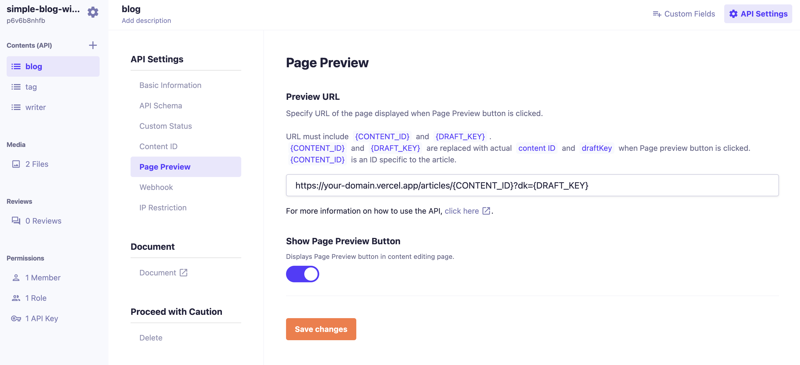

# Simple Blog with microCMS


This is an official microCMS simple blog template.

This blog is built using microCMS, a headless CMS made in Japan, and Next.js.

This template supports authoring and editing the following blog content and information:

- Blog details
- Writer
- Tags

## Demo

https://simple-blog-with-microcms.vercel.app/

## Deploy to Vercel

[](https://vercel.com/new/clone?demo-description=This%20is%20a%20microCMS%20official%20simple%20blog%20template.&demo-image=https://github.com/microcmsio/simple-blog-with-microcms/blob/main/public/cover.png?raw=true&demo-title=Simple%20Blog%20with%20microCMS&demo-url=https://simple-blog-with-microcms.vercel.app/&from=templates&project-name=Simple%20Blog%20with%20microCMS&repository-name=simple-blog-with-microcms&repository-url=https://github.com/microcmsio/simple-blog-with-microcms&env=MICROCMS_API_KEY,MICROCMS_SERVICE_DOMAIN,BASE_URL)

## Configuration

### Create an account and a service on microCMS

1. Create an account on [microCMS](https://app.microcms.io/signup).
2. Create a new empty service from the [dashboard](https://app.microcms.io/create-service). When creating the service, please select "Create your own".
3. Enter any value you like for **Service Name** and **Service ID**.
4. You now have a new service created that you can access!

### Create APIs

You will need to create three APIs, all in the **list** format.

#### Create `tag` API.

The `tag` API is for creating tags associated with blog content. Blog content can have multiple tags set within the tag API.

1. Go to `/create-api` (https://your-service-id.microcms.io/create-api) and select "Create your own".
2. Enter basic API information:
   - API Name: **tag**
   - Endpoint: **tags**
3. Select API Type and choose **List** Format.
4. Define API Schema. The `tag` API has one field:
   - `name` - **Text Field**. **Field ID** and **Display Name** should be set to `name`.
5. Click "Create" and continue.


#### Create `writer` API

The `writer` API is for creating author information and associating it with each blog article. A blog article can only have one writer set in the writer API.

1. Go to `/create-api` (https://your-service-id.microcms.io/create-api) and select "Create your own".
2. Enter basic API information:
   - API Name: **writer**
   - Endpoint: **writers**
3. Select API Type and choose **List** Format.
4. Define API Schema. The `writer` API has three fields:
   - `name` - **Text Field**. **Field ID** and **Display Name** should be set to `name`.
   - `profile` - **Text Area**. **Field ID** and **Display Name** should be set to `profile`.
   - `image` - **Image Field**. **Field ID** and **Display Name** should be set to `image`.
5. Click "Create" and continue.


#### Create `blog` API

The `blog` API is for creating blog content.

1. Go to `/create-api` (https://your-service-id.microcms.io/create-api) and select "Create your own".
2. Enter basic API information:
   - API Name: **blog**
   - Endpoint: **blog**
3. Select API Type and choose **List** Format.
4. Define API Schema. The `blog` API has six fields:
   - `title` - **Text Field**. **Field ID** and **Display Name** should be set to `title`.
   - `description` - **Text Area**. **Field ID** and **Display Name** should be set to `description`.
   - `content` - **Rich Text Editor**. **Field ID** and **Display Name** should be set to `content`.
   - `thumbnail` - **Image Field**. **Field ID** and **Display Name** should be set to `thumbnail`.
   - `tags` - **Multiple Content References - tag**. **Field ID** and **Display Name** should be set to `tags`.
   - `writer` - **Content Reference - writer**. **Field ID** and **Display Name** should be set to `writer`.
5. Click "Create" and continue.


### Enter Content

1. Enter content for the `tag` API, `writer` API, and `blog` API. Since the `tag` API and `writer` API are referenced from the `blog` API, please create the `blog` API content last.

2. Go to the `/apis/[tags|writers|blog]/create` endpoint, click "**+ Add**", enter content for each of the following and click publish:

**tag**

- You just need 1 tag content.
- Use dummy data for the text.

**writer**

- You just need 1 writer content.
- Use dummy data for the text and image.

**blog**

- You just need 1 blog content.
- Use dummy data for the text and image.


### Retrieve API Key

1. From the top page of the dashboard, Go to **"/api-keys"**.
2. Copy and retrieve the value of the **"default"** API Key.

This API key will be used to make requests to microCMS from Next.js.

### Running locally

1. Retrieve and set your local environment variables. Create a `.env.local` file in the root of the project and enter the following microCMS values:

```
MICROCMS_API_KEY=xxxxxxxxxx
MICROCMS_SERVICE_DOMAIN=xxxxxxxxxx
BASE_URL=xxxxxxxxxx
```

- `MICROCMS_API_KEY`: Retrieve the API key from the microCMS dashboard under "Service Settings > API Keys".
- `MICROCMS_SERVICE_DOMAIN`: Retrieve the service domain from the microCMS dashboard URL (https://xxxxxxxx.microcms.io).
- `BASE_URL`: The deployment URL and protocol. For example:
  - Development: http://localhost:3000
  - Production: https://xxxxxxxx.vercel.app

2. Install package dependencies

```bash
npm install
```

3. Launch the local development web server

```bash
npm run dev
```

4. Open [http://localhost:3000](http://localhost:3000) in your browser and access your local application!

**Important**: This application requires Node.js version 18 or higher.

### Deploy your project to Vercel

1. [Import your repository](https://vercel.com/docs/getting-started-with-vercel/import) from GitHub, GitLab, or Bitbucket.
2. Click on the environment variables and set `MICROCMS_API_KEY`, `MICROCMS_SERVICE_DOMAIN` and `BASE_URL`.
3. Click Deploy!

#### Deploy from Our Template

Alternatively, you can deploy our template by clicking on the Deploy button at the top of this page and setting the same environment variables.

---

# Appendix

## Page Preview Settings

In order to preview draft content, a page preview must be set up in the microCMS administration page.

Set the following in "API Settings > Page Preview" of the Blog API.

Replace `your-domain` with your deployed domain. (It also works with localhost)



Once set, the page preview button will be available on the content editing page.
